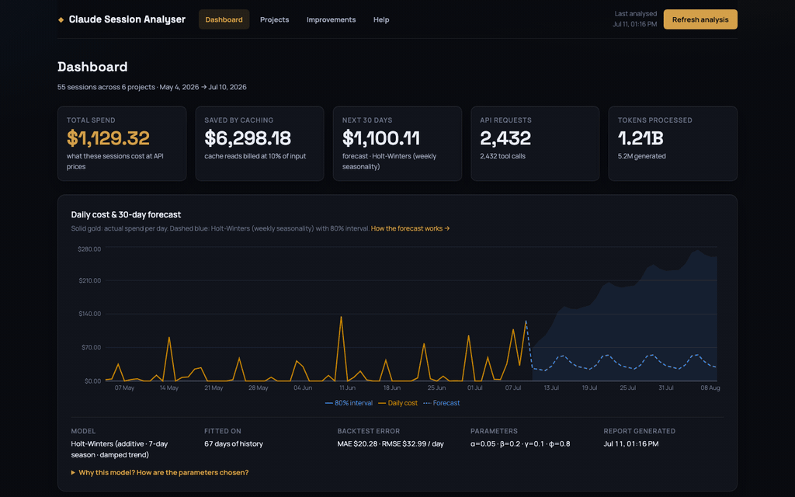
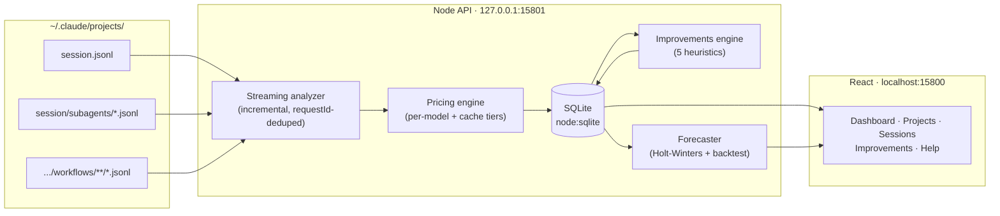

<div align="center">

# 📊 Claude Session Analyser

**Find out exactly what your Claude Code sessions cost — and how to make them cheaper.**

*Local-first analytics, token-saving recommendations, and ML cost forecasting for every
Claude Code session on your machine. No cloud, no telemetry, one `npm install`.*



[](LICENSE)
[](package.json)
[](#development)
[](#development)

</div>

---

Claude Code writes a detailed transcript of every session to `~/.claude/projects/` — every API
request, every token, every model. Almost nobody looks at it. **Claude Session Analyser** turns
that folder into answers:

- 💸 **"What did this week actually cost?"** — real per-model API pricing, including prompt-cache
  reads/writes and subagent usage buried three directories deep.
- 📉 **"Where am I wasting tokens?"** — five heuristics scan your usage patterns and put a dollar
  figure on every bad habit: premium models on trivial prompts, cold caches, 400k-token contexts,
  drive-by micro-sessions, output-dominated spend.
- 🔮 **"What will next month cost?"** — a Holt-Winters forecaster (with honest prediction
  intervals and automatic backtesting) projects your next 30 days.
- 🔒 **"Who sees my data?"** — nobody. The server binds to `127.0.0.1`, reads *only usage
  metadata* (never your prompts or Claude's replies), and stores aggregates in a local SQLite file.

## Quick start

```bash
git clone https://github.com/jig21nesh/claude-session-analyser.git
cd claude-session-analyser
npm install
npm run dev
```

Open **http://localhost:15800** — the first scan runs automatically and takes a few seconds even
for gigabytes of transcripts. After that, the **Refresh** button re-analyses incrementally (only
new or changed sessions are parsed).

> Ports: web UI `15800`, API `15801` — deliberately outside the default-port crowd, overridable
> via `PORT` / `API_PORT`.

## What you get

| Page | What it shows |
|---|---|
| **Dashboard** | Total & per-model spend, money already saved by prompt caching, token composition donut, top projects, daily cost line **with 30-day forecast band** |
| **Projects** | Every project Claude Code touched, ranked by cost, with drill-down |
| **Project detail** | Per-project daily costs, model mix, session list, and project-specific savings |
| **Session detail** | One session's true cost — including subagent & workflow-agent usage — with per-model breakdown and cache hit rate |
| **Improvements** | Ranked, dollar-quantified recommendations for cutting your bill |
| **Help** | Plain-English docs: cost math, the forecasting model and its alternatives, heuristic thresholds |

## The #1 way to save: route prompts by complexity

The analyser will almost certainly tell you what it told us: **most spend goes to premium models
answering prompts that never needed one.** The fix is
[**model-switcher**](https://github.com/jig21nesh/model-switcher) — a Claude Code hook that
classifies each prompt's complexity, keeps your session on a low-cost model, and delegates only
genuinely COMPLEX prompts to a heavy model via a subagent. The Improvements page estimates what
it would save *you*, from your own usage data.

## How the forecast works (and why Holt-Winters)

Daily Claude Code spend is small data with strong structure: a baseline, a growth trend, and a
weekly rhythm (nobody refactors on Sunday… usually). That is precisely the shape
**Holt-Winters triple exponential smoothing** was built for:

- **additive decomposition** into level + damped trend + 7-day seasonality — every component
  inspectable and explainable;
- smoothing parameters chosen by **grid search over rolling-origin backtests** (time-series
  cross-validation on one-step-ahead RMSE), not hand-waving;
- **80% / 95% prediction intervals** from backtest residuals, widening with horizon;
- automatic degradation: linear regression under 14 days of history, historical mean under 5;
- pure JavaScript, zero extra runtime — fits in milliseconds on every refresh.

We evaluated ARIMA/SARIMA (needs more data and careful order selection), Prophet (excellent, but
drags a Python/Stan runtime into a one-command npm tool) and LSTM/boosting (wildly over-powered
for ~100 data points). The full trade-off analysis lives in
[`docs/adr/0004-ml-model-holt-winters.md`](docs/adr/0004-ml-model-holt-winters.md) and in the
in-app **Help** page — including when you should switch (6+ months of history → SARIMA/Prophet).

## Architecture



- **Zero native dependencies** — storage is Node's built-in `node:sqlite`; installs anywhere
  Claude Code runs.
- **Incremental by design** — sessions are re-parsed only when their files change; a refresh
  after the first scan takes well under a second.
- **Subagent-aware** — usage recorded by subagents and workflow agents (nested under
  `<session>/subagents/`) is merged into the parent session and deduplicated by request id, so
  costs are complete, not just the main transcript.
- **Privacy line in the code, not the docs** — the parser extracts token counts, models and
  timestamps; message content never leaves the transcript files.

Key decisions are recorded as ADRs in [`docs/adr/`](docs/adr).

## Development

```bash
npm test                      # server (node:test) + client (vitest) — 56 tests
npm run coverage              # backend coverage via c8 (98% statements)
npm run dev                   # API + web with hot reload
```

The transcript format is undocumented and evolves with Claude Code releases; the parser is
deliberately defensive (malformed lines are counted, never fatal). If a new format breaks
something, an issue with a redacted sample line is gold.

## Roadmap ideas

- Budget alerts (notify when the forecast crosses a monthly target)
- Per-branch cost attribution
- SARIMA/Prophet sidecar for long histories
- Export to CSV / Parquet

PRs welcome — read [`CLAUDE.md`](CLAUDE.md) for project conventions and add an ADR for anything
architectural.

## License

[MIT](LICENSE) — use it, fork it, ship it.

---

<div align="center">
<em>Built with Claude Code, analysed by itself. The dashboard above is our real usage —
yes, we needed model-switcher too.</em>
</div>
